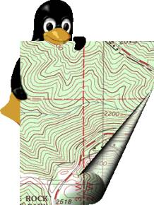
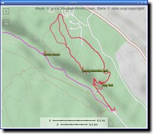
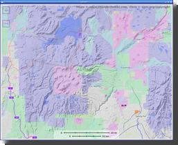
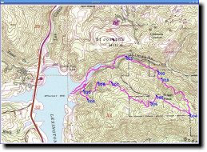
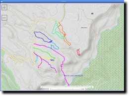
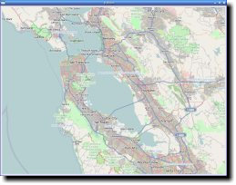
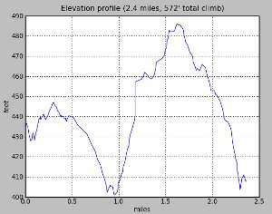

==========================
PyTopo: A Tiled Map Viewer
==========================

(and Track and Waypoint Editor)
###############################

PyTopo is a desktop tiled map viewer that can also show and edit
track logs, waypoints and other simple geographic data.

PyTopo can use tiles from a variety of sources, such as OpenStreetMap,
and can read track or waypoint files in most common formats.
It can also make simple edits to track logs and waypoints, and
save the result in GPX format.

Downloaded map tiles are cached locally, so you can use PyTopo offline
if you’ve already cached the tiles for an area.

The package also includes ellie, a simple script for reporting and
plotting distance and elevation change statistics from a GPX track log.

It's developed on Linux, but should be able to run on any platform
that supports Python and GTK3.

The official documentation lives at:
https://pytopo.readthedocs.io/en/latest/

.. contents:: **Quick Links:**
    :local:

Screenshots
-----------

+--------------------------------------------------------+------------------------------------------+
| |bandelier|                                            | |landuse|                                |
+--------------------------------------------------------+------------------------------------------+
| Track logs and waypoints from hiking in Bandelier NP   | Land use overlay for northern New Mexico |
+--------------------------------------------------------+------------------------------------------+
| |lexington|                                            | |DOE|                                    |
+--------------------------------------------------------+------------------------------------------+
| Trail above Lexington reservoir, using USGS/Topo! maps | Trails in near White Rock, NM            |
+--------------------------------------------------------+------------------------------------------+
| |frisco|                                               | |ellie|                                  |
+--------------------------------------------------------+------------------------------------------+
| San Francisco from the default view (OSM tiles)        | Ellie track log statistics               |
+--------------------------------------------------------+------------------------------------------+

.. _Using PyTopo:

Using PyTopo
------------

The first time you run pytopo, it will create a configuration file,
typically *~/.config/pytopo/pytopo.sites* (if it can't create that it
will fall back to *~/.pytopo* instead).

You might want to take a look at the file: this is where you can add
additional map collections or sites you visit frequently.

By default, pytopo will download OpenStreetMap tiles to *~/Maps*.
You can change that by editing the MapCollection definitions in
*pytopo.sites*. See the
`PyTopo File Formats <https://shallowsky.com/software/topo/fileformats.html>`_
page for lots of gory details.

*pytopo -p* will print out a list of known sites. With the initial
default configuration you'll just have a few cities like
san-francisco, new-york, london, sydney; this is mostly to show you
how to add your own points of interest.

*pytopo -h* prints help.

Usage (command-line arguments)
------------------------------

::

   Usage: pytopo
          pytopo trackfile
          pytopo known_site
          pytopo [-t trackfile] [-c collection] [-o overlay] [-r] [site_name]
          pytopo [-t trackfile] start_lat start_lon [collection]
          pytopo -p :  list known sites, collections and tracks
          pytopo -r :  re-download all map tiles that need to be shown
          pytopo -h :  print this message

   Other flags:
          -k keys   : comma-separated list of fields (keys) to look for
                      when grouping polygonal regions.
          -g        : follow a GPS if available
          -d[level] : debugging mode. Defaults to 1, level 2 shows a little more.

   With no arguments, will display a menu of known sites
   (defined in pytopo.sites).

   Map collections are defined in pytopo.sites.
   Overlays are also collections, drawn translucently on top of the base map,
    and there can be more than one.

   Track files may be in GPX, KML, KMZ or GeoJSON format, and may contain
   track points and/or waypoints; multiple track files are allowed.
   GeoJSON files may also contain polygons: use the -k option to specify
   which field in the GeoJSON feature should be used for coloring groups.

   Use decimal degrees for coordinates.

   Set up favorite site names in ~/.config/pytopo.sites,
   favorite track logs in ~/Tracks

   Move around by dragging and zoom with the mousewheel, or use the keyboard:
     Left/right/up/down:  move in that direction
                  +/=/-:  zoom in/out
               spacebar:  go back to last pinned location
                      m:  bring up the site selection dialog
                      q:  quit

   Right-click gives a context menu.
   Shift-click in the map to print the coordinates of the clicked location,
   as well as distance and bearing from the last shift-clicked point,
   to standard output.

Key and Mouse bindings
----------------------

============   ===========================================
Arrow keys     Scroll the map in the indicated direction.
+/=, -         Zoom in or out.
s              Save the current map to a file under $HOME/Topo
Space          Jump back to the pinned location.
m              Switch to a different known site
q              Quit
============   ===========================================

Dragging and mousewheel move and scroll the map, as you'd expect.
Right-clicking pops up a menu of other options.

Track Logs, Waypoints and Overlays
----------------------------------

PyTopo can read track logs in GPX, KML, KMZ or geojson format, and
polygon overlay files in geojson. It shows each
track in a different color. You can toggle waypoint visibility with
the right-click context menu (for when there are too many waypoints
and they get in the way of reading the map).

You can make simple edits to tracks, like splitting a track into parts
or deleting to the beginning or end point, and can save the resulting
tracks as a GPX file.

Select a track by left-clicking on it. The right-click context menu lets
you split a track or delete everything before or after the mouse
position, and save a track as GPX after you’ve changed it.

You can also provide polygonal overlays from a GeoJSON file: for
example, to colorize areas according to land ownership or geology.

PyTopo can also measure distances and bearing angles between points
(shift-click and watch standard output). The right-click context menu
reports the coordinates at the mouse position; if you want to
copy/paste, choose that menu item to print it to standard output.

For displaying or plotting distances and elevations, ellie is included
as part of the PyTopo install.

Tiles: Getting Map Data
-----------------------

By default, PyTopo sets up maps from OpenStreetMap and the USGS.
There are various sources of map tiles, but many of them require that
you register for an API key.

On startup, PyTopo will create a file called *pytopo.sites*: on Linux
you'll find it in *~/.config/pytopo*, but it may be elsewhere on other
platforms. You can edit that file to add new tile sources.

There are quite a few sources of
`WMS <https://en.wikipedia.org/wiki/Web_Map_Service>`_
map data available, but many of them require that you register for
an API key. You'll find an example in *pytopo.sites*
of how to set up tiles from ThunderForest using an API key.
Some tile providers, like Google, don’t allow their tiles to be used
by other programs, so please respect that and use sources that
don't have such restrictions.

Or you can create your own tiles. OpenStreetMap has a page on
`Creating Your Own Tiles <https://wiki.openstreetmap.org/wiki/Creating_your_own_tiles>`_
from OpenStreetMap data, but the process is fairly elaborate and poorly
documented. You can also use a large map and split it into tiles with
a program like ImageMagick, where you'd use a command like::

    convert source-map.jpg -rotate 90 -crop 300x300 -repage +0+0 out-map%02d.jpg

(Don't use *-trim*; it will give you maps of inconsistent sizes, and
pytopo will have no way to tell where the origin of the map should be.)

PyTopo can also use tiles from a few commercial programs like the old
*National Geographic Topo!* CDROM sets.

The PyTopo classes that read tiles are called *MapCollections*. There are
several different types, but for most online WMS tile servers you'll
generally want an *OSMMapCollection*, and copying the examples in
*pytopo.sites* is the easiest way to make a new one. See the
`API documentation <https://pytopo.readthedocs.io/en/latest/#api-documentation>`_
for other types of MapCollections.

Installing and Dependencies
---------------------------

PyTopo is available on PyPI:
::

    pip install pytopo

It installs two programs: pytopo, the map viewer, and ellie, which shows
track log statistics. If you have matplotlib installed and your track log
has elevations, ellie can plot them, showing how much you climbed and
descended.

`PyTopo's source is hosted on Github <https://github.com/akkana/pytopo>`_
if you want the latest and greatest.

Dependencies include

-  GTK3 (and its various dependencies, like pangocairo)
-  requests-futures (for downloading map tiles in the background)
-  simplejson (for reading XML-based formats like GPX and KML)

Optional dependencies include

-  numpy (for analyzing track statistics like distance)
-  matplotlib ( for Ellie’s track log visualizations)
-  shapely (used for polygonal overlays)
-  The programs gpsd and python-gps (to read from a GPS device)

I've only tested PyTopo on Linux, but in theory it should run on any
platform. If not, let me know.

Other Info
----------

*pytopo -h* gives usage examples.

If you need custom maps., edit *~/.config/pytopo/pytopo.sites* to add
new map Collections: see examples in that file or on the project home
page.

Code contributions appreciated!

Tests and Documentation
-----------------------

The official documentation is at
https://pytopo.readthedocs.io/en/latest/

To build the documentation locally:

::

   python setup.py build_sphinx

or

::

   cd sphinxdoc
   make html

There are some unit tests in the test/ directory; run them with::

    python -m unittest discover

from the top-level directory.

Happy mapping!

